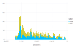

# Forgetting Weights Comparison


In order to compare the results of the changes made to `linear_forgetting_weights()` function as seen in the [ Forgetting Weights PR](https://github.com/IQVIA-ML/TreeParzen.jl/pull/38), the following objective function and space was defined to produce answers:


```julia
using Test
using TreeParzen

function objective_min(space)
    x = space[:x]
    y = space[:y]
    z = space[:z]

    return x^3 - 4x^2 + 6x - 24 + z^5 + y^6
end

space = Dict(
    :x => HP.Uniform(:x, -5.0, 5.0),
    :y => HP.Uniform(:y, -5.0, 5.0),
    :z => HP.Uniform(:z, -5.0, 5.0),
)

answers = [
    fmin(objective_min, space, 100) |> objective_min
    for _ in 1:1000
]

```

Based on the above, 100 fmin trials were run with the following objective function `x^3 - 4x^2 + 6x - 24 + z^5 + y^6` and 1000 answers were obtained.

The experiment was run with the `TreeParzen v0.1.1` from before the adjustments to `forgetting_weights()` were made (label: old) and with the current implementation (label: new) as seen in the [Forgetting Weights PR](https://github.com/IQVIA-ML/TreeParzen.jl/pull/38)

The answers from the `old` and `new` runs have been stored in the respective `.txt` files for any future reference [old answers](docs/compare_fweights/oldarr.txt) and [new answers](docs/compare_fweights/newarr.txt).
They were then used as the variables `old_arr` and `new_arr` to plot the below visualisation.

```julia
df = DataFrame(answers = vcat(new_arr, old_arr), label = vcat(repeat([:new], 1000), repeat([:old], 1000)))
plot(df, x=:answers, color=:label, Geom.histogram)
```



There have been no abnormalities observed and the answers between the `old` and `new` runs are in line.
