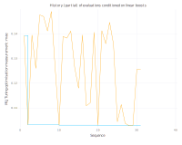

# Using TreeParzen to optimise hyperparameters with MLJ

A small set of demonstrations on how to use TreeParzen to optimise machine learning model hyperparameters.
Worked examples are given for
- Basic usage, to select some hyperparameters for a single model
- Inspecting optimisation history using the MLJ history
- Slightly more advanced usage, including how to use MLJs acceleration and provide hyperparameter suggestions to TreeParzen
- A more complex search space example, where parameters are conditioned on the selection of a certain parameter value

We will go through a couple of ways to use TreeParzen with MLJ using XGBoost method and reduced AMES data set.

## Setup

To start off, activate an environment and install the following packages:

```julia
] add Gadfly@1.2.1 TreeParzen MLJ DataFrames XGBoost MLJModels MLJTuning CategoricalArrays ComputationalResources
```

## Initial data loading and preparation

Lets start with usual program boilerplate:

```julia
import Gadfly, MLJ, DataFrames, TreeParzen, MLJTuning, MLJModels, CategoricalArrays, ComputationalResources

import Random: seed!

Gadfly.set_default_plot_size(20Gadfly.cm, 16Gadfly.cm)

seed!(1999)
```

Next we define a few helper functions, for simplifying plotting, and some of the data preprocessing.

Plot helper:
```julia
function opt_hist_plot(tuning_history, title)

    metric_name = String(Symbol(first(first(tuning_history)[2].measure)))
    metric = first.(getfield.(getfield.(tuning_history, 2), :measurement))
    cummetric = accumulate(min, metric)

    upper_bound = min(minimum(metric) * 3, maximum(metric))

    plotobj = Gadfly.plot(
        Gadfly.layer(x=1:length(metric), y=metric, Gadfly.Geom.line, Gadfly.Theme(default_color=Gadfly.colorant"orange")),
        Gadfly.layer(x=1:length(metric), y=cummetric, Gadfly.Geom.step),
        Gadfly.Guide.ylabel("MLJ Tuning optimisation measurement: $metric_name"; orientation=:vertical),
        Gadfly.Guide.xlabel("Sequence"),
        Gadfly.Coord.Cartesian(ymax=upper_bound),
        Gadfly.Guide.Title(title),
    )

    Gadfly.display(plotobj)
end
```

Preprocessing (this is for turning all the data to Float64, due to SciTypes of XGBoost):
```julia
conv(x::CategoricalArrays.CategoricalArray) = Float64.(MLJ.int(x))
conv(x) = Float64.(x)
```

Set up a few constants:
```julia
NUM_CV_FOLDS = 4
PCT_TRAIN_DATA = 0.75
NUM_TP_ITER_SMALL = 25
NUM_TP_ITER_LARGE = 250
```

Finally, let us load our AMES dataset and do the preprocessing:
```julia
Features, targets = MLJ.@load_reduced_ames
# This one turns strings into not strings, and everything into Float64s
IntCat_Features = NamedTuple{keys(Features)}(conv.(values(deepcopy(Features))))
Features = DataFrames.DataFrame(Features)
IntCat_Features = DataFrames.DataFrame(IntCat_Features)

# Do hold-out partitioning. If you want same results each time use shuffle=false or set RNG seed
train, test = MLJ.partition(eachindex(targets), PCT_TRAIN_DATA, shuffle=true)

train_features = IntCat_Features[train, :]
train_targets = targets[train]

test_features = IntCat_Features[test, :]
test_targets = targets[test]

num_train_data = length(train_targets)
training_data_per_fold = (num_train_data / NUM_CV_FOLDS) * (NUM_CV_FOLDS - 1)
```

These are some of the modelling decisions, which aren't necessarily strongly reasoned about, but just picked reasonable that will allow us to start modelling quickly.
- Test holdout : 25%
- 4 fold cross validation -- this leaves each individual training set with ~820 data points and ~200 for evaluation on each fold
- Optimising using MAE as the metric because we will assess final quality on RMSL (and because for this example we're going to optimise directly in logspace since AMES regression targets are positive valued)


## Construct first TreeParzen space

When doing this, it is useful to try to reason about ranges of hyperparamters where possible,
to help guide choices for minimum/maximum ranges.

In theory you want to try to allow the model to overfit and underfit a little, because the
choice of metric and resampling should help hyperparameter optimiser avoid the overfitting
and underfitting scenarios and settle on a generalising model.

If the hyperparameter range
is purely within an overfit or underfit only regime then this obviously becomes more difficult.

For [XGBoost](https://xgboost.readthedocs.io/en/latest/parameter.html#parameters-for-tree-booster)
we select a few of the most seemingly impactful parameters to do with regularisation and fitting
parameters. Seven parameters are selected for optimisation. Let us define our TreeParzen search space
```julia
space = Dict(
    :num_round => TreeParzen.HP.QuantUniform(:num_round, 1., 500., 1.),
    :eta => TreeParzen.HP.LogUniform(:eta, -3., 0.),
    :gamma => TreeParzen.HP.LogUniform(:gamma, -3., 3.),
    :max_depth => TreeParzen.HP.QuantUniform(:max_depth, 1., ceil(log2(training_data_per_fold)), 1.0),
    :min_child_weight => TreeParzen.HP.LogUniform(:min_child_weight, -5., 2.),
    :lambda => TreeParzen.HP.LogUniform(:lambda, -5., 2.),
    :alpha => TreeParzen.HP.LogUniform(:alpha, -5., 2.),
)
```

Now let us try to do some fitting. By default, TreeParzen tuning uses 20 intial completely
random guesses to seed the distribution modelling it uses for optimisation. Then afterwards,
the TreeParzen algorithm will be used. We start by trying to do tuning for 25 attempts, and
inspecting the hold-out evaluated RMSL and learning history plot.

```julia
tuning = MLJTuning.TunedModel(
    model=model_tpl,
    ranges=space,
    tuning=TreeParzen.MLJTreeParzen.MLJTreeParzenTuning(),
    n=NUM_TP_ITER_SMALL,
    resampling=MLJ.CV(nfolds=NUM_CV_FOLDS),
    measure=MLJ.mav,
)

mach = MLJ.machine(tuning, train_features, log.(train_targets))
MLJ.fit!(mach)

pred = exp.(MLJ.predict(mach, test_features))
@show MLJ.rmsl(test_targets, pred)

best_model = MLJ.fitted_params(mach).best_model

for x in keys(space) println("$x = $(getproperty(best_model, x))") end

opt_hist_plot(mach.report.history, "Simple optimisation of tree boosting")
```

We might see something like this:
```
[ Info: Training Machine{DeterministicTunedModel{MLJTreeParzenTuning,…}} @ 1…52.
[ Info: Attempting to evaluate 25 models.
Evaluating over 20 metamodels: 100%[=========================] Time: 0:00:42
Evaluating over 1 metamodels: 100%[=========================] Time: 0:00:00
Evaluating over 1 metamodels: 100%[=========================] Time: 0:00:00
Evaluating over 1 metamodels: 100%[=========================] Time: 0:00:00
Evaluating over 1 metamodels: 100%[=========================] Time: 0:00:00
Evaluating over 1 metamodels: 100%[=========================] Time: 0:00:00
MLJ.rmsl(test_targets, pred) = 0.14420318184838515
lambda = 0.05727746727948698
alpha = 0.08421863969080966
gamma = 0.08165847470165424
min_child_weight = 2.234309963272397
eta = 0.09817948832286466
num_round = 125
max_depth = 5
```

And the learning history


In this example, it looks like the best parameters were found during the random phase of
search, but this is expected given 80% of the search was during random phase.


## Tuning using suggestions

TreeParzen.jl is about to take user provided suggestions for tuning hyperparameters.
We demonstrate so by using the best results from last tuning as a suggestion. This
necessarily isn't proper data science methodology, just a simple way to demonstrate
the functionality.

```julia
suggestion = Dict(key => getproperty(best_model, key) for key in keys(space))

# we cannot pass a dict, so construct the MLJTreeParzenSpace object
# we can also provide an Array of Dicts as suggestion
search = TreeParzen.MLJTreeParzen.MLJTreeParzenSpace(space, suggestion)

tuning = MLJTuning.TunedModel(
    model=model_tpl,
    ranges=search,
    tuning=TreeParzen.MLJTreeParzen.MLJTreeParzenTuning(;random_trials=3),
    n=NUM_TP_ITER_SMALL,
    resampling=MLJ.CV(nfolds=NUM_CV_FOLDS),
    measure=MLJ.mav,
)

mach = MLJ.machine(tuning, train_features, log.(train_targets))
MLJ.fit!(mach)

pred = exp.(MLJ.predict(mach, test_features))
@show MLJ.rmsl(test_targets, pred)

best_model = MLJ.fitted_params(mach).best_model

for x in keys(space) println("$x = $(getproperty(best_model, x))") end
```

## MLJ acceleration and TreeParzen interaction

We can also accelerate learning by using parallelism.
Notice from outputs above how above we had 20 metamodels followed by sequences of 1?
What is happening here is that there is an initial stage (by default 20)
of models drawn entirely at random (using specified prior distributions)
without probabilistic modelling. Once probabilistic modelling kicks in,
we draw a suggestion and then update with the result. This doesn't seem amenable
to parallelism, and it isn't.

However, there is an additional parameter
`max_simultaneous_draws` which allows the system to draw `n` samples before
updating the distribution. Whilst intuitively this allows parallelism, it
also enables more exploration before drawing again according to updated distribution.


If using this parameter, consider increasing the value of `linear_forgetting`
from its default of 25 to a higher number -- a good place is probably at least `n * 25`. The
`linear_forgetting` parameter keeps most n recently observed results equally weighted
and older observations are weighted by a linear ramp according to their age in history.

```julia

tuning = MLJTuning.TunedModel(
    model=model_tpl,
    ranges=space,
    tuning=TreeParzen.MLJTreeParzen.MLJTreeParzenTuning(;random_trials=3, max_simultaneous_draws=2, linear_forgetting=50),
    n=NUM_TP_ITER_SMALL,
    resampling=MLJ.CV(nfolds=NUM_CV_FOLDS),
    measure=MLJ.mav,
)

mach = MLJ.machine(tuning, train_features, log.(train_targets))
MLJ.fit!(mach)
```

Outputs might look something like this:
```
[ Info: Training Machine{DeterministicTunedModel{MLJTreeParzenTuning,…}} @ 1…58.
[ Info: Attempting to evaluate 25 models.
Evaluating over 3 metamodels: 100%[=========================] Time: 0:00:04
Evaluating over 2 metamodels: 100%[=========================] Time: 0:00:00
Evaluating over 2 metamodels: 100%[=========================] Time: 0:00:07
Evaluating over 2 metamodels: 100%[=========================] Time: 0:00:02
Evaluating over 2 metamodels: 100%[=========================] Time: 0:00:03
Evaluating over 2 metamodels: 100%[=========================] Time: 0:00:03
Evaluating over 2 metamodels: 100%[=========================] Time: 0:00:01
Evaluating over 2 metamodels: 100%[=========================] Time: 0:00:06
Evaluating over 2 metamodels: 100%[=========================] Time: 0:00:04
Evaluating over 2 metamodels: 100%[=========================] Time: 0:00:07
Evaluating over 2 metamodels: 100%[=========================] Time: 0:00:05
Evaluating over 2 metamodels: 100%[=========================] Time: 0:00:01
```

It's worth noting, that this changes behaviour of optimiser but didn't
introduce parallelism directly: That's up to MLJ. So lets parallelise.

It wouldn't really accelerate computations in this case possibly due to
overheads, but is an option for larger tasks. Also note that we can instead
parallelise via `resampling_acceleration` if we don't want to alter behaviour of
optimiser, but this might be more limited.

```julia
tuning = MLJTuning.TunedModel(
    model=model_tpl,
    ranges=space,
    tuning=TreeParzen.MLJTreeParzen.MLJTreeParzenTuning(;random_trials=3, max_simultaneous_draws=2, linear_forgetting=50),
    n=NUM_TP_ITER_SMALL,
    resampling=MLJ.CV(nfolds=NUM_CV_FOLDS),
    measure=MLJ.mav,
    acceleration=ComputationalResources.CPUProcesses(),
)

mach = MLJ.machine(tuning, train_features, log.(train_targets))
MLJ.fit!(mach)
```

## Optimising parameters conditionally

One of the main reasons to consider TreeParzen over other hyperparmater
optimisers is the ability to make conditional parameter selections.
TreeParzen supports "tree-structured"
parameter spaces; hence the name.

Originally conceived for optimising
Deep Belief Networks (DBNs), where parameters take form such as number of layers,
and how many nodes are within each layer. Here, we can see the idea that if
we have 2 layers, then number of nodes in layer 3 as a parameter is not relevant.


We can construct a similar example using XGBoost - either we can use boosted trees
or boosted linears. Some parameters are relevant in both cases, but even so we
would want to model them differently, e.g. `num_iterations` might need to be lower for
boosting trees than for boosting linear functions.

Let us demonstrate how to do this with MLJ. First, create a container model,
because of space nesting we need to do this, plus its constructor and MLJ integration methods:

```julia
mutable struct tuned_xgb <: MLJ.Deterministic
    xgb::XGBoostRegressor
end
tuned_xgb(;xgb=Dict{Symbol, Any}()) = tuned_xgb(XGBoostRegressor(;xgb...))
# quick fit and predict methods
MLJ.fit(t::tuned_xgb, verbosity::Int, X, y, w=nothing) = MLJ.fit(t.xgb, verbosity, X, y, w)
MLJ.predict(t::tuned_xgb, fitted, X) = MLJ.predict(t.xgb, fitted, X)
```

Next we define the sampling stratgies for when it is boosted trees:
```julia
tree_space = Dict(
    :booster => "gbtree",
    :num_round => TreeParzen.HP.QuantUniform(:num_round_tree, 50., 750., 1.),
    :eta => TreeParzen.HP.LogUniform(:eta_tree, -3., 0.),
    :gamma => TreeParzen.HP.LogUniform(:gamma_tree, -3., 3.),
    :max_depth => TreeParzen.HP.QuantUniform(:max_depth_tree, 1., ceil(log2(training_data_per_fold)), 1.0),
    :min_child_weight => TreeParzen.HP.LogUniform(:min_child_weight_tree, -5., 1.),
    :lambda => TreeParzen.HP.LogUniform(:lambda_tree, -5., 1.),
    :alpha => TreeParzen.HP.LogUniform(:alpha_tree, -5., 1.),
)
```

And again for boosted linears:
```julia
linear_space = Dict(
    :booster => "gblinear",
    :updater => "coord_descent",
    :num_round => TreeParzen.HP.QuantUniform(:num_round_linear, 500., 1000., 1.),
    :lambda => TreeParzen.HP.LogUniform(:lambda_linear, -10., 0.),
    :alpha => TreeParzen.HP.LogUniform(:alpha_linear, -10., 0.),
    :feature_selector => TreeParzen.HP.Choice(:feature_selector_linear, ["cyclic", "greedy"]),
)
```

Now we combine them so that it chooses either one search space or another (and then select the parameters for each)
```julia
joint_space = Dict(
    :xgb => TreeParzen.HP.Choice(:xgb, [linear_space, tree_space])
)
```

We can demonstrate this in action before tuning, to see how this looks:
```
julia> TreeParzen.ask(joint_space).hyperparams
Dict{Symbol,Any} with 1 entry:
  :xgb => Dict{Symbol,Any}(:lambda=>0.119987,:alpha=>0.0272653,:gamma=>0.104878,:min_child_weight=>0.261203,:eta=>0.545388,:num_round=>453.0,:booster=>"gbtree",:max_depth=>20.0)

julia> TreeParzen.ask(joint_space).hyperparams
Dict{Symbol,Any} with 1 entry:
  :xgb => Dict{Symbol,Any}(:lambda=>0.0105321,:alpha=>0.0851159,:feature_selector=>"greedy",:num_round=>652.0,:booster=>"gblinear",:updater=>"coord_descent")

julia> TreeParzen.ask(joint_space).hyperparams
Dict{Symbol,Any} with 1 entry:
  :xgb => Dict{Symbol,Any}(:lambda=>0.0358872,:alpha=>0.0376287,:gamma=>0.127843,:min_child_weight=>0.263583,:eta=>0.158916,:num_round=>699.0,:booster=>"gbtree",:max_depth=>2.0)

julia>
```

Now lets do the tuning and see results:
```julia
tuning = MLJTuning.TunedModel(
    model=tuned_xgb(),
    ranges=joint_space,
    tuning=TreeParzen.MLJTreeParzen.MLJTreeParzenTuning(;random_trials=50),
    n=NUM_TP_ITER_LARGE,
    resampling=MLJ.CV(nfolds=NUM_CV_FOLDS),
    measures=MLJ.mav,
)

# Do the usual fitting
mach = MLJ.machine(tuning, train_features, log.(train_targets))
MLJ.fit!(mach)

# Print out final evaluation, but we dont know what the best model is yet
pred = exp.(MLJ.predict(mach, test_features))
@show MLJ.rmsl(test_targets, pred)

# Take a look at the best performing model
best_model = MLJ.fitted_params(mach).best_model.xgb
if best_model.booster == "gbtree"
    println("Tree params")
    for x in keys(tree_space) println("$x = $(getproperty(best_model, x))") end
else
    println("Linear params")
    for x in keys(linear_space) println("$x = $(getproperty(best_model, x))") end
end
```

Outputs something like:
```
MLJ.rmsl(test_targets, pred) = 0.1457077530787174
Tree params
lambda = 0.007069086005760277
alpha = 0.007161086625441588
gamma = 0.04994531306681755
min_child_weight = 0.010814412676636258
eta = 0.061806646130508215
num_round = 534
booster = gbtree
max_depth = 4
```


We can look at optimisation history:
```julia
opt_hist_plot(mach.report.history, "Conditional optimisation of tree/linear boosting")
```


and we can also look at parts of it by filtering according to saved model hyperparameters. For linear we got:
```julia
linear_selected = getfield.(getfield.(first.(mach.report.history), :xgb), :booster) .== "gblinear"
linear_hist = mach.report.history[linear_selected]
opt_hist_plot(linear_hist, "History (partial) of evaluations conditioned on linear boosts")
```


And for trees we got:
```julia
tree_hist = mach.report.history[.!linear_selected]
opt_hist_plot(tree_hist, "History (partial) of evaluations conditioned on tree boosts")
```

