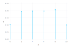
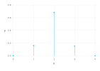

# Defining Hyperparameter search ranges

## Contents

1. [HP.Choice](#hpchoice)
1. [HP.PChoice](#hppchoice)
    1. [HP.Prob](#hpprob)
1. [HP.Uniform](#hpuniform)
1. [HP.QuantUniform](#hpquantuniform)
1. [HP.Normal](#hpnormal)
1. [HP.QuantNormal](#hpquantnormal)
1. [HP.LogNormal](#hplognormal)
1. [HP.LogQuantNormal](#hplogquantnormal)
1. [HP.LogUniform](#hploguniform)
1. [HP.LogQuantUniform](#hplogquantuniform)


## Functions

### HP.Choice
```julia
Choice(
    label::Symbol,
    options::Array{T,1} where T,
) -> TreeParzen.HP.Choice

```

Randomly choose which option will be extracted, and also supply the list of options. The elements of options can themselves be nested stochastic expressions. In this case, the stochastic choices that only appear in some of the options become conditional parameters. Initially each choice will be given an equal weight. To favour some choices over others, see [PChoice](#hppchoice)

Example:

```julia
example_space = Dict(
    :example => HP.Choice(:example, [1.0, 0.9, 0.8, 0.7]),
)
```

Example of conditional paramaters:

```julia
example_space_conditional = Dict(
    :example => HP.Choice(:example, [
        (:case1, HP.Uniform(:param1, 0.0, 1.0)),
        (:case2, HP.Uniform(:param2, -10.0, 10.0)),
    ]),
)
```

`:param1` and `:param2` are examples of conditional parameters. Each of `:param1` and `:param2` only features in the returned sample for a particular value of `:example`. If `:example` is 0, then `:param1` is used but not `:param2`. If `:example` is 1, then `:param2` is used but not `:param1`.

Example with nested arrays of different lengths:

```julia
example_space_nested = Dict(
    :example => HP.Choice(:example, [
        [HP.Normal(:d0_c0, 0.0, 5.0)],
        [HP.Normal(:d1_c0, 0.0, 5.0), HP.Normal(:d1_c1, 0.0, 5.0)],
        [
            HP.Normal(:d2_c0, 0.0, 5.0), HP.Normal(:d2_c1, 0.0, 5.0),
            HP.Normal(:d2_c2, 0.0, 5.0),
        ],
    ]),
)
```

Note that all labels (the symbol given as the first parameter to all the `HP.*` functions) must be unique. These labels identify the parts of the space that the optimiser learns from over iterations.


### HP.PChoice
```julia
PChoice(
    label::Symbol,
    probability_options::Array{TreeParzen.HP.Prob,1},
) -> TreeParzen.HP.PChoice

```

Choose from a list of options with weighted probabilities

#### Data Structures

##### HP.Prob
```julia
struct Prob
```

  * `probability::Float64`
  * `option::Any`

State the weighted probability of an option, for use with `PChoice`.

#### Arguments

  * `label`               : Label
  * `probability_options` : Array of Prob objects

Example:

```julia
example_space = Dict(
    :example => HP.PChoice(
        :example,
        [
            Prob(0.1, 0),
            Prob(0.2, 1),
            Prob(0.7, 2),
        ]
    )
)
```

Note that the `Prob` probability weights must sum to 1.

To look at the distribution we can do the following:
```julia
trials = [ask(example_space) for i in 1:1000]
samples = getindex.(getproperty.(trials, :hyperparams), :example)
vals = sort(unique(samples))
counts = sum(samples .== vals'; dims=1)
probs = dropdims(counts'/sum(counts), dims=2)
Gadfly.plot(x=vals, y=probs, Gadfly.Geom.hair, Gadfly.Geom.point, Gadfly.Scale.y_continuous(minvalue=0.0), Gadfly.Guide.xticks(ticks=vals), Gadfly.Guide.yticks(ticks=Float64.(0:0.1:1)))
```


### HP.Uniform
```julia
Uniform(
    label::Symbol,
    low::Union{Float64, TreeParzen.Delayed.AbstractDelayed},
    high::Union{Float64, TreeParzen.Delayed.AbstractDelayed},
) -> TreeParzen.HP.Uniform

```

Returns a value with uniform probability from between `low` and `high`. When optimising, this variable is constrained to a two-sided interval.

```julia
example_space = Dict(
    :example => HP.Uniform(:example, 0.0, 1.0),
)
```

where `label` is the parameter and the returned value is uniformly distributed between `low` at 0.0 and `high` at 1.0

To look at the distribution we can do the following:
```julia
trials = [ask(example_space) for i in 1:1000]
samples = getindex.(getproperty.(trials, :hyperparams), :example)
Gadfly.plot(x=samples, Gadfly.Stat.density(bandwidth=0.05), Gadfly.Geom.polygon(fill=true, preserve_order=true))

```


N.B. the distribution looks like it has tails beyond 0 and 1 due to use of kernel density estimates, but in fact verify the sampled values are contained within specified range:
```julia
@show(minimum(samples));
@show(maximum(samples));
```
> minimum(samples) = 0.0013577594712426144
>
> maximum(samples) = 0.9985292682892326


### HP.QuantUniform
```julia
QuantUniform(
    label::Symbol,
    low::Union{Float64, TreeParzen.Delayed.AbstractDelayed},
    high::Union{Float64, TreeParzen.Delayed.AbstractDelayed},
    q::Union{Float64, TreeParzen.Delayed.AbstractDelayed},
) -> TreeParzen.HP.QuantUniform

```

Returns a value uniformly between low and high, with a quantisation. When optimising, this variable is constrained to a two-sided interval.

```julia
example_space = Dict(
    :example => HP.QuantUniform(:example, 0.0, 10.0, 2.0),
)
```

where `label` is the parameter and the returned value is uniformly distributed between `low` at 0.0 and `high` at 10.0, with the `q`uantisation set at 2.0. Valid sampled values would be 0.0, 2.0, 4.0, 6.0, 8.0 and 10.0.

To look at the distribution we can do the following:
```julia
trials = [ask(example_space) for i in 1:1000]
samples = getindex.(getproperty.(trials, :hyperparams), :example)
vals = sort(unique(samples))
counts = sum(samples .== vals'; dims=1)
probs = dropdims(counts'/sum(counts), dims=2)
Gadfly.plot(x=vals, y=probs, Gadfly.Geom.hair, Gadfly.Geom.point, Gadfly.Scale.y_continuous(minvalue=0.0), Gadfly.Guide.xticks(ticks=vals))
```



N.B. the falloff at the distribution tails, this is to do with the choice of 2.0 for quantisation and reduction in number of samples that appear to each of the extreme values after quantisation (specifically, roughly half).


### HP.Normal
```julia
Normal(
    label::Symbol,
    mu::Union{Float64, TreeParzen.Delayed.AbstractDelayed},
    sigma::Union{Float64, TreeParzen.Delayed.AbstractDelayed},
) -> TreeParzen.HP.Normal

```

Returns a real value that's normally-distributed with mean mu and standard deviation sigma. When optimizing, this is an unconstrained variable.

```julia
example_space = Dict(
    :example => HP.Normal(:example, 4.0, 5.0),
)
```

To look at the distribution we can do the following:
```julia
trials = [ask(example_space) for i in 1:1000]
samples = getindex.(getproperty.(trials, :hyperparams), :example)
Gadfly.plot(x=samples, Gadfly.Stat.density(bandwidth=1), Gadfly.Geom.polygon(fill=true, preserve_order=true))

```


### HP.QuantNormal
```julia
QuantNormal(label::Symbol, mu::Union{Float64, TreeParzen.Delayed.AbstractDelayed}, sigma::Union{Float64, TreeParzen.Delayed.AbstractDelayed}, q::Union{Float64, TreeParzen.Delayed.AbstractDelayed}) -> TreeParzen.HP.QuantNormal

```

Returns a real value that's normally-distributed with mean `mu` and standard deviation `sigma`, with a quantisation.
When optimizing, this is an unconstrained variable.

```julia
example_space = Dict(
    :example => HP.QuantNormal(:example, 2., 0.5, 1.0),
)
```

In this example, the values are sampled normally first, and then `q`uantised in rounds of 1.0, so one
only observes 1.0, 2.0, 3.0, etc, centered around 2.0.

To look at the distribution we can do the following:
```julia
trials = [ask(example_space) for i in 1:1000]
samples = getindex.(getproperty.(trials, :hyperparams), :example)
vals = sort(unique(samples))
counts = sum(samples .== vals'; dims=1)
probs = dropdims(counts'/sum(counts), dims=2)
Gadfly.plot(x=vals, y=probs, Gadfly.Geom.hair, Gadfly.Geom.point, Gadfly.Scale.y_continuous(minvalue=0.0), Gadfly.Guide.xticks(ticks=vals))
```



N.B. that due to rounding, the observed values do not follow exactly normal distribution, particularly
when sigma is much smaller than quantisation.

### HP.LogNormal
```julia
LogNormal(
    label::Symbol,
    mu::Union{Float64, TreeParzen.Delayed.AbstractDelayed},
    sigma::Union{Float64, TreeParzen.Delayed.AbstractDelayed},
) -> TreeParzen.HP.LogNormal

```

Returns a value drawn according to `exp(normal(mu, sigma))` so that the logarithm of the sampled value is normally distributed. When optimising, this variable is constrained to be positive.

```julia
example_space = Dict(
    :example => HP.LogNormal(:example, log(3.0), 1.0),
)
```

In this example, the log normal distribution will be centred around 3. The distribution is not truncated.

To look at the distribution we can do the following:
```julia
trials = [ask(example_space) for i in 1:1000]
samples = getindex.(getproperty.(trials, :hyperparams), :example)
Gadfly.plot(x=samples, Gadfly.Stat.density(bandwidth=0.5), Gadfly.Geom.polygon(fill=true, preserve_order=true), Gadfly.Scale.x_log10, Gadfly.Guide.xlabel("x (log)"))
```


Note that Gadfly density estimates appear to be wrong in log-scale.

Because mean is hard to determine on log-scale, lets inspect it directly:
```julia
@show(sum(samples)/length(samples));
```
> sum(samples) / length(samples) = 5.099150419827341


However, kernel density estimates incorrectly show the distribution containing density below 0.

```julia
@show(minimum(samples));
```
> minimum(samples) = 0.1251765366832742


### HP.LogQuantNormal
```julia
LogQuantNormal(
    label::Symbol,
    mu::Union{Float64, TreeParzen.Delayed.AbstractDelayed},
    sigma::Union{Float64, TreeParzen.Delayed.AbstractDelayed},
    q::Union{Float64, TreeParzen.Delayed.AbstractDelayed},
) -> TreeParzen.HP.LogQuantNormal

```

Returns a value drawn according to `exp(normal(mu, sigma))`, with a quantisation, so that the logarithm of the sampled value is normally distributed. When optimising, this variable is constrained to be positive.

```julia
example_space = Dict(
    :example => HP.LogQuantNormal(:example, log(3.0), 0.5, 2.0),
)
```

In this example, the log normal distribution will be centred around 3. The distribution is not truncated. The values with be quantised to multiples of 2, i.e. 2.0, 4.0, 6.0, etc.

To look at the distribution we can do the following:
```julia
trials = [ask(example_space) for i in 1:1000]
samples = getindex.(getproperty.(trials, :hyperparams), :example)
vals = sort(unique(samples))
counts = sum(samples .== vals'; dims=1)
probs = dropdims(counts'/sum(counts), dims=2)
Gadfly.plot(x=vals, y=probs, Gadfly.Geom.hair, Gadfly.Geom.point, Gadfly.Scale.y_continuous(minvalue=0.0), Gadfly.Guide.xticks(ticks=vals))
```


### HP.LogUniform
```julia
LogUniform(
    label::Symbol,
    low::Union{Float64, TreeParzen.Delayed.AbstractDelayed},
    high::Union{Float64, TreeParzen.Delayed.AbstractDelayed},
) -> TreeParzen.HP.LogUniform

```

Returns a value drawn according to `exp(uniform(low, high))` such that the logarithm of the return value is uniformly distributed. When optimizing, samples are constrained to the interval `[exp(low), exp(high)]`, which is positive.

```julia
example_space = Dict(
    :example => HP.LogUniform(:example, log(1.0), log(5.0)),
)
```

To look at the distribution we can do the following:
```julia
trials = [ask(example_space) for i in 1:1000]
samples = getindex.(getproperty.(trials, :hyperparams), :example)
Gadfly.plot(x=samples, Gadfly.Stat.density(bandwidth=0.25), Gadfly.Geom.polygon(fill=true, preserve_order=true))
```


N.B. the distribution looks like it has tails beyond 0 and 1 due to use of kernel density estimates, but in fact verify the sampled values are contained within specified range:
```julia
@show(minimum(samples));
@show(maximum(samples));
```
> minimum(samples) = 1.0009891079479816
>
> maximum(samples) = 4.996578568933641

### HP.LogQuantUniform
```julia
LogQuantUniform(label::Symbol, low::Union{Float64, TreeParzen.Delayed.AbstractDelayed}, high::Union{Float64, TreeParzen.Delayed.AbstractDelayed}, q::Union{Float64, TreeParzen.Delayed.AbstractDelayed}) -> TreeParzen.HP.LogQuantUniform

```

Returns a value drawn according to `exp(uniform(low, high))`, with a quantisation, such that the logarithm of the return value is uniformly distributed.

Suitable for a discrete variable with respect to which the objective is "smooth" and gets smoother with the size of the value, but which should be bounded both above and below.

```julia
example_space = Dict(
    :example => HP.QuantLogUniform(:example, log(1.0), log(5.0), 1.0),
)
```

In this example, the distribution will be log-uniform sampled from the range 1-5, with quantisation in steps of 1.

To look at the distribution we can do the following:
```julia
trials = [ask(example_space) for i in 1:1000]
samples = getindex.(getproperty.(trials, :hyperparams), :example)
vals = sort(unique(samples))
counts = sum(samples .== vals'; dims=1)
probs = dropdims(counts'/sum(counts), dims=2)
Gadfly.plot(x=vals, y=probs, Gadfly.Geom.hair, Gadfly.Geom.point, Gadfly.Scale.y_continuous(minvalue=0.0), Gadfly.Guide.xticks(ticks=vals))
```


N.B. due to quantisation, values at extreme ends of distribution contain fewer samples than they might ordinarily for their continuous counterpart.
